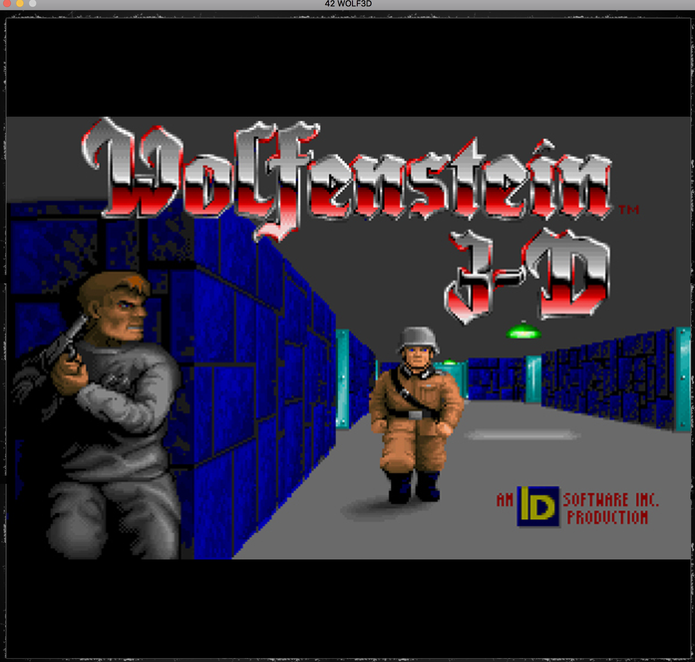
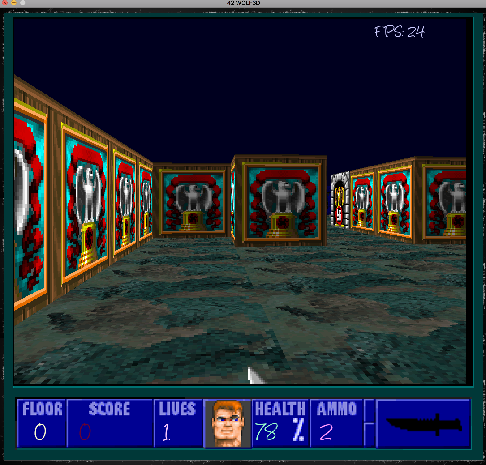

# Wolf3D
Raycasting game project
 
Usage :
 
./wolf3d maps/file3.wf
 
Keys  t to change the texture, and h to display map;
 
mouse for rotation as well as Left, Right Keys
 
Up  : forward
 
Bottom : backward
 
Press A for changing the arm
 
Press Space To use Your knife or gun
 
Your mission, collect every tiles considered as objects (just by passing through them) in the game before the time.
 
Note that the intention was to understand game concepts such as animation ...

 

 
